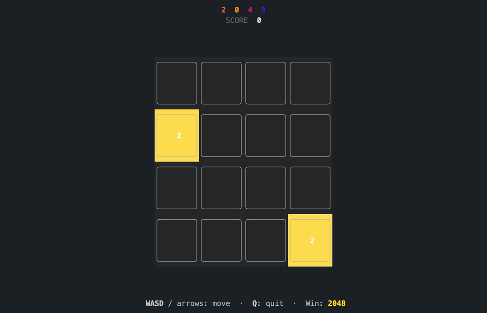

# twozero48 🎰
A CLI implementation of 2048, in rust

## Demo
<p align="center">
    
</p>

## Installation
To play the game, first install the crate:
```sh
cargo install twozero48
```

If you want to compile from source, [ensure you have the rust tool chain installed][rustup], by going to after cloning to local and opening the directory in terminal, run
```sh
cargo run
```

## Usage

```sh
twozero48
twozero48 --board-size 5 --winning 4096
twozero48 --help

---
CONTROLS:

WASD / arrow keys: move
Q / Esc / Ctrl-C: quit
```

## Acknowledgements

1. [ratatui] - the best way to build terminal UIs. period.
2. [crossterm] - terminal handling done right.
3. [clap] - breeziest cli argument parsing.
4. [rand] - plug and play (pseudo)random number generation.
5. [criterion] - easy benchmarking!

## License
Code in this repository is licensed under the permissive MIT license. All code contributions are by default considered to be under the same.

[rustup]: https://rustup.rs
[ratatui]: https://ratatui.rs/
[crossterm]: https://github.com/crossterm-rs/crossterm
[clap]: https://docs.rs/clap/
[rand]: https://docs.rs/rand/
[criterion]: https://bheisler.github.io/criterion.rs/book/
